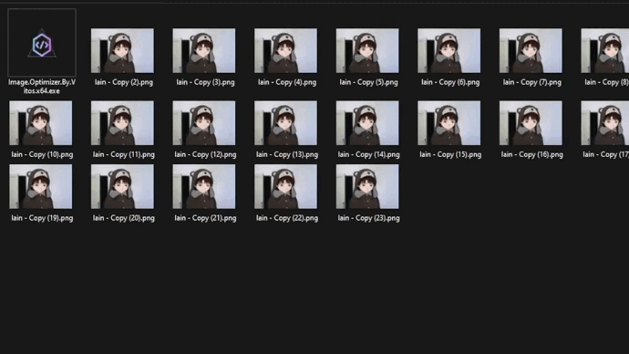

# Image Optimizer By Vitos

Welcome to **Image Optimizer By Vitos**, your go-to solution for optimizing images! This powerful tool effortlessly reduces the file size of your images by converting them to the efficient .webp format. Additionally, you have the flexibility to set maximum horizontal or vertical resolutions for your images, giving you complete control over the optimization process.

## [Download Here](https://github.com/vitosnatios/Image-Optimizer-By-Vitos/releases/tag/v1.0)

## Easy to Use

Simply run the application in the folder where you want to optimize your images. The process is seamless and user-friendly. Here's what you can expect:

1. **Automatic Backup**: The application takes care of your precious images by creating a backup in the "imageOptimizerBackup" folder. Your original images are preserved in the same directory structure, ensuring a secure backup.

2. **Efficient Formatting**: Image optimization begins promptly after the backup. The application efficiently formats all images within the specified directory and its subdirectories, streamlining the entire optimization process.

Experience the transformation as Image Optimizer By Vitos enhances your images while maintaining the utmost convenience. Download now and witness the magic!
